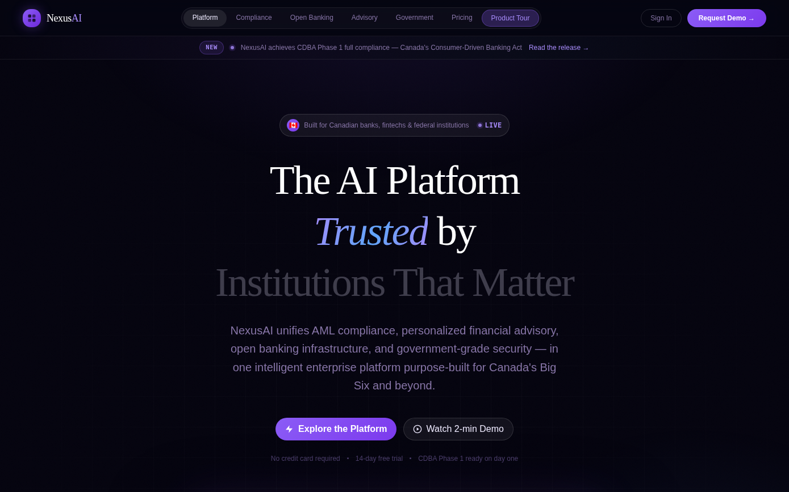

# NexusAI — AI-Driven Banking Assistant

**Intelligent Banking, Trusted Future.**



## Overview
An AI-powered banking platform for Canadian financial institutions.

## Problem
Canadian banks and fintechs need AML/fraud detection and open-banking-aligned infrastructure, but building this in-house is slow and building it without a compliance-first design creates regulatory risk later.

## Solution
A unified platform combining real-time AML/fraud monitoring, graph-based transaction network analysis, and an API-first architecture designed around open banking principles — explicitly not claiming formal regulatory certification it doesn't have.

## Key Capabilities
- Enhanced AML and fraud detection with AI-powered risk scoring
- Graph-based transaction network analysis (money laundering ring detection)
- Open banking-aligned API architecture (architectural goal, not a certified compliance claim — no formal CDBA or regulatory certification exists)

## Technology Stack

| Layer | Technology |
|---|---|
| Frontend | React, TypeScript, Tailwind CSS, shadcn/ui |
| Testing | Vitest |

## Testing
```bash
npm run test
```
One of the few repos in this portfolio with real automated test coverage wired into CI — preserve and extend this rather than letting it lapse.

## Project Status
Active development with real test coverage. Regulatory/compliance claims are explicitly scoped as architectural goals, not certifications.

## Contributing
See the [org-wide CONTRIBUTING.md](https://github.com/creova-gif/.github/blob/main/CONTRIBUTING.md).

## License
Proprietary — © CREOVA. All rights reserved.

## Author / Organization
Built by [Justin Mafie](https://github.com/creova-gif) under CREOVA.

## Documentation
See `CLAUDE.md` for AI-agent-specific notes.
